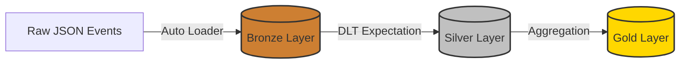

## 🛒 Azure Databricks Retail Lakehouse

[](https://azure.microsoft.com/)
[](https://databricks.com/)
[](https://www.python.org/)

## 📖 Project Overview

This project demonstrates a production-grade **Medallion Architecture** pipeline built on **Azure Databricks**. It ingests real-time streaming data, enforces data quality using **Delta Live Tables (DLT)**, and aggregates business metrics for downstream BI reporting.

**Goal:** Process raw user-action events into a Gold-level "Daily Action Count" table using the Lakehouse paradigm.

---

## 🏗 Architecture

### Medallion Architecture Layers

* **Bronze Layer (Ingestion):** Uses **Auto Loader (`cloudFiles`)** to incrementally ingest raw JSON data from cloud storage. Handles schema evolution automatically.
* **Silver Layer (Quality):** Cleans data and enforces schema validation using **DLT Expectations**. Rows with missing actions are dropped to ensure data integrity.
* **Gold Layer (Aggregates):** Aggregates daily user actions for executive reporting.



---

## 🛠 Tech Stack

* **Cloud Provider:** Microsoft Azure
* **Platform:** Databricks (Premium Tier)
* **Orchestration:** Delta Live Tables (DLT) Workflows
* **Storage Format:** Delta Lake
* **Language:** PySpark (Python)
* **Data Source:** Databricks public sample datasets

---

## 🚀 Getting Started

### Prerequisites

1. **Azure Databricks Workspace** (Premium tier required for DLT)
2. **Unity Catalog Access** (or legacy Hive Metastore)
3. **Compute Resources** (Ability to create a DLT Pipeline)

---

## 📋 Step-by-Step Setup

### Step 1: Clone the Repository

1. Log into your Azure Databricks workspace.
2. Navigate to **Workspace** → **Users** → *[Your Username]*.
3. Click **Create** → **Git Folder** (or Import).
4. Enter repository URL:
```
[https://github.com/Tithir-Mahmud-Bakshi/azure-databricks-retail-lakehouse.git](https://github.com/Tithir-Mahmud-Bakshi/azure-databricks-retail-lakehouse.git)

```


*(Or manually upload the `elt_pipeline.py` file if Git integration is not configured)*

### Step 2: Create a Delta Live Tables Pipeline

> ⚠️ **Important:** This code uses the `dlt` module which **only works in DLT pipelines**, not regular notebooks!

1. **Navigate to Workflows:**
* In the left sidebar, click **Workflows** → **Delta Live Tables**
* Click **Create Pipeline**


2. **Configure Pipeline Settings:**
| Setting | Value | Description |
| --- | --- | --- |
| **Pipeline Name** | `Retail_Lakehouse_Demo` | Choose any name |
| **Product Edition** | **Advanced** | Required for Data Quality Expectations |
| **Pipeline Mode** | **Triggered** | Runs once as a batch (saves cost) |
| **Source Code** | `/Workspace/.../elt_pipeline.py` | Select the file you imported |
| **Destination** | **Unity Catalog** | Recommended for governance |
| **Catalog** | `db_ws_exam_prep` | (Or your main catalog) |
| **Target Schema** | `retail_lakehouse` | The database to create |


3. **Click "Create"**

---

### Step 3: Run the Pipeline

1. Click **Start**.
2. The pipeline will provision a cluster (approx. 3-5 minutes).
3. Watch the graph turn **Green** for Bronze, Silver, and Gold.

---

### Step 4: Verify Results

Once the pipeline completes, use the **SQL Editor** to query the results.

**Note:** Replace `<catalog>` with your Unity Catalog name (e.g., `db_ws_exam_prep` or `azure_databricks_personal`).

```sql
-- View Bronze raw events
SELECT * FROM <catalog>.retail_lakehouse.bronze_events LIMIT 10;

-- View Silver cleaned events (No NULL actions)
SELECT * FROM <catalog>.retail_lakehouse.silver_events LIMIT 10;

-- View Gold aggregated metrics
SELECT * FROM <catalog>.retail_lakehouse.gold_daily_action_counts 
ORDER BY event_date DESC;

```

---

## 💻 Code Highlights

### 1. Auto Loader (Bronze Layer)

Efficiently ingests new files without expensive directory listings:

```python
@dlt.table(comment="Raw streaming data ingested via Auto Loader")
def bronze_events():
    return (
        spark.readStream.format("cloudFiles")
        .option("cloudFiles.format", "json")
        .option("cloudFiles.inferColumnTypes", "true")
        .load(SOURCE_PATH)
    )

```

### 2. Data Quality Expectations (Silver Layer)

Enforce data integrity with declarative quality rules (`expect_or_drop`):

```python
@dlt.expect_or_drop("valid_action", "action IS NOT NULL")
def silver_events():
    return (
        dlt.read("bronze_events")
        .select(...)
        # ... transformation logic
    )

```

### 3. Business Aggregations (Gold Layer)

Create analytics-ready datasets for BI tools:

```python
@dlt.table(comment="Daily summary of user actions")
def gold_daily_action_counts():
    return (
        dlt.read("silver_events")
        .groupBy("event_date", "action")
        .agg(count("*").alias("action_count"))
        .orderBy(desc("event_date"))
    )

```

---

## 🔧 Troubleshooting

### Error: "UC_HIVE_METASTORE_DISABLED_EXCEPTION"

**Cause:** You are querying without specifying the Catalog.
**Solution:** Use the 3-level namespace in your query: `SELECT * FROM <catalog>.<schema>.<table>` (e.g., `db_ws_exam_prep.retail_lakehouse.gold_daily_action_counts`).

### Error: "ModuleNotFoundError: No module named 'dlt'"

**Cause:** You are trying to run `elt_pipeline.py` as a standard notebook.
**Solution:** This file must be run as a **DLT Pipeline** (Workflows -> Delta Live Tables).

---

## 📊 Sample Output

After successful execution, your Gold table will contain aggregated daily metrics:

| event_date | action | action_count |
| --- | --- | --- |
| 2016-07-28 | Close | 5820 |
| 2016-07-28 | Open | 4822 |
| 2016-07-27 | Open | 590 |

---

## 🔄 Next Steps (Optimization)

To prepare this pipeline for high-scale production, the next step is implementing **Optimization** strategies:

1. **Partitioning:** Partitioning the Silver table by `event_date` to speed up date-based filtering.
2. **Z-Ordering:** Applying `OPTIMIZE ... ZORDER BY (action)` on the Gold table to speed up specific action queries.

---

## 🤝 Contributing

Contributions are welcome! Please feel free to submit a Pull Request.

---

**Happy Data Engineering! 🚀**

```

```
